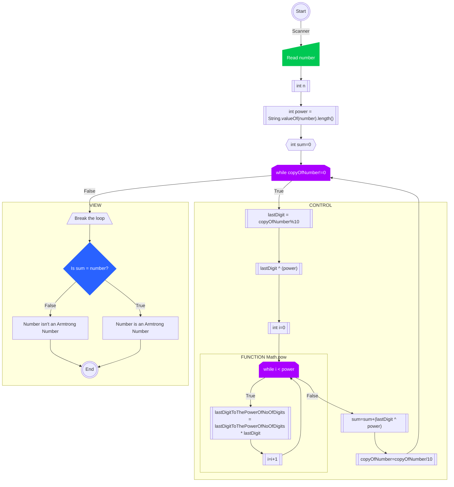

# my_Armstrong_Number

## Diagrama de Flujo

```mermaid

flowchart TD
%% nodes
    A(((Start)))
    B@{shape: manual-input, label: "Read number"}
    C[[int n ]]
    D[["int power = String.valueOf(number).length()"]]
    E{{int sum=0}}
    F@{ shape: notch-pent, label: "while copyOfNumber!=0"}
    G[[lastDigit = copyOfNumber%10]]
    H[["lastDigit ^ (power)"]]
    I[[int i=0]]
    J@{ shape: notch-pent, label: "while i < power"}
    K[["sum=sum+(lastDigit ^ power)"]]
    L[[copyOfNumber=copyOfNumber/10]]
    M[[lastDigitToThePowerOfNoOfDigits = lastDigitToThePowerOfNoOfDigits * lastDigit ]]
    N[[i=i+1]]
    T[/Break the loop\]
    W@{shape: diamond, label: Is sum = number?}
    X["Number isn't an Armtrong Number"]
    Y[Number is an Armtrong Number]
    Z(((End)))

 %% Areas y Conexion   
    A -->|Scanner| B --> C --> D --> E --> F 
    F -->|True| G 
    subgraph CONTROL
    G --> H --> I --> J
    J -->|False| K
    subgraph FUNCTION Math.pow
    J -->|True| M --> N --> J
    end
    K --> L 
    end
    L--> F -->|False| T
    subgraph VIEW
    T --> W -->|False|X --> Z
    W -->|True|Y --> Z
    end

 %% Stilos   
    style B color:#FFFFFF, stroke:#00C853, fill:#00C853
    style F color:#FFFFFF, fill:#AA00FF, stroke:#AA00FF
    style J color:#FFFFFF, fill:#AA00FF, stroke:#AA00FF
    style W color:#FFFFFF, stroke:#2962FF, fill:#2962FF


```
